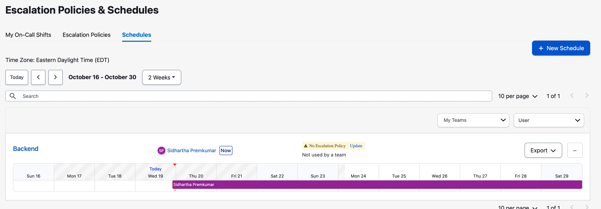
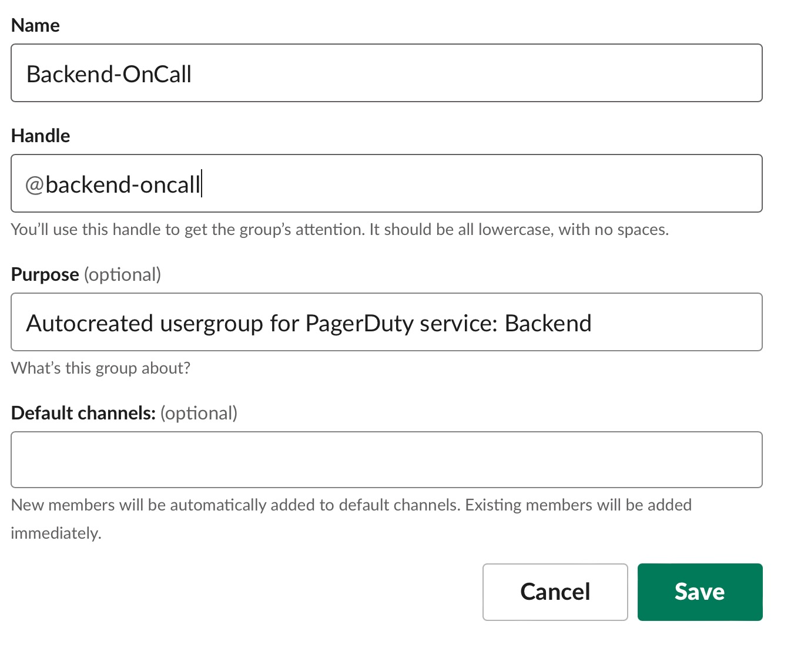

# pd2Slack

This python project will automatically sync on call PagerDuty services to Slack User Groups.

For example if you have an on call schedule such as: 
<p align="center">
  
</p>

It will automatically create a slack user group as follows
<p align="center">
  
</p>

With "Sidhartha Premkumar" as the sole member of @backend-oncall. 

The mapping is done via email matching, this assumes the pager duty email matches the slack email. 

## Running

To run, all you have to do is:
```
> pip3 install pd2slack
> pd2slack -slackApiKey {SLACK_API_KEY} -pdApiKey {PD_API_KEY}
```

We also support environment variable, for example:
```
> export SLACK_API_KEY=123
> export PD_API_KEY=123
> pd2Slack
```

## Deploying

You can deploy this program by running the process `pd2Slack` on a schedule (based on how often you want to update). A cron might be the best way to deploy